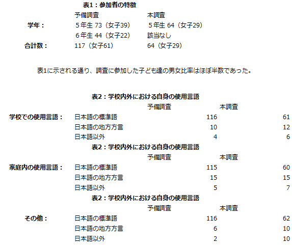
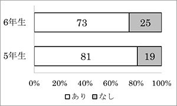
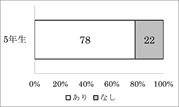
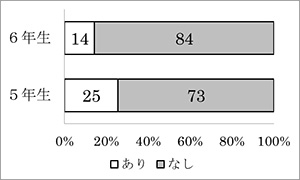
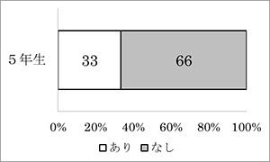
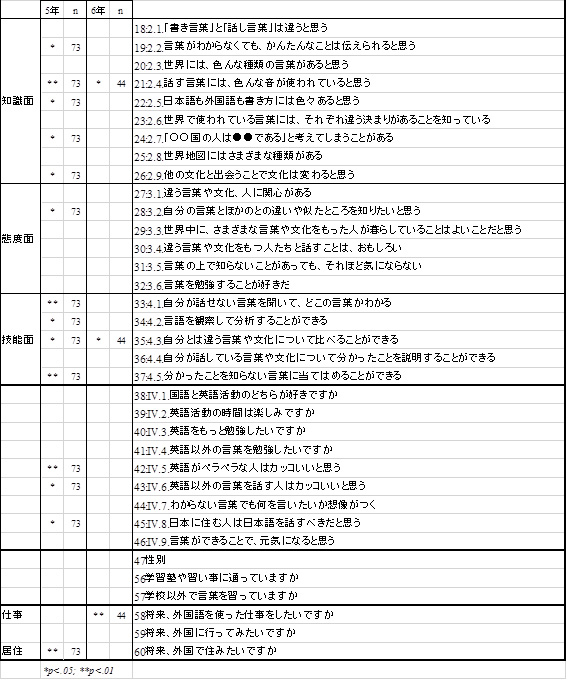
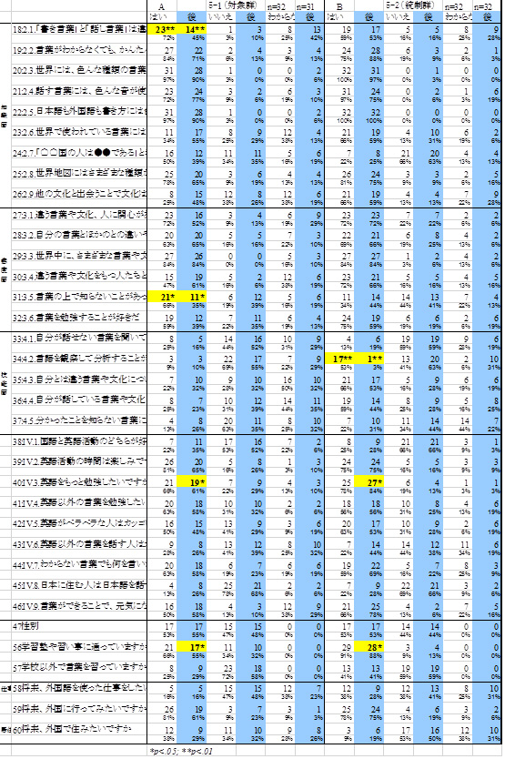

==================
教材と教育 
==================

教材と国際理解教育
------------------

**多言語・多文化教材と国際理解教育**

**山西優二**

今回の「多言語・多文化教材研究」プロジェクトにおいて、教材を開発し実践を生み出すにあたって、その前提となったのが文化・ことばの捉え直しであった。現状への問題意識、文化・ことばを取り巻く状況とその状況に即した国際理解教育のあり様について、以下考察しておくことにしたい。

**1．はじめに－問題意識－**

文化は生きている。ことばは生きている。人間が、この地球上で、共に生きていくために創り出してきたものが、文化であり、ことばである。人間は、自然との関係、社会との関係、歴史との関係の中で、文化そしてことばをつくり出し活用し、またそれらの関係のあり様の変化の中で、徐々に文化そしてことばを変容させてきた。まさに文化そしてことばは動的なものであり、生き物のようでもある。
ただこの文化そしてことばの変容のプロセスが、いま地球上で急速に起こりつつある。グローバル社会といわれるように、特に経済や政治におけるグローバル化が進展する中で、グローバル的文化・価値が急速に広がる一方、「グローバル」と「ローカル」、「現代」と「伝統」、「物質」と「精神」の間などにみられるように、数多くの文化・価値間に緊張・対立関係が生み出されつつある。またボーダレスの時代といわれるように、人・情報の移動が活発化するのに伴い、国内外を問わず、地域社会の多文化化、多言語化は急速に進展している。まさに今、世界の文化そしてことばは大きな変動の波の中にある。
そんな中、人間はその変動に十分に対応できているのだろうか。変動があまりに速くかつ多面的に生じているために、文化そしてことばの創造の主体である人間が、その主体性を見失っているかのようにも見える。ではこのような状況の中で、人間がまさに文化創造の主体としての力、「文化力」を形成していくには、人間は何を学んでいけばよいのだろうか。またその学びを紡ぎ、その学びをより意味あるものにするための働きかけである教育は、いまの文化・ことばの状況にどのように対峙していくことが求められているのだろうか。
文化やことばを扱う教育の一つとして国際理解教育がある。国際理解教育は、永年にわたり文化理解の促進やことばを通してのコミュニケーション力の育成に力点を置いてきた。しかし筆者は、これまでの国際理解教育のあり様では、今の文化・ことばの状況に十分には対応できないと考えている。その理由を簡単に言えば、教育実践における文化の扱い方が静的相対主義的であり、理解の対象としてのみ文化を扱っていることや、ことばの捉え方として「道具」としての側面のみに力点を置き、ことばそのものに内在する文化や問題などを「対象」として十分に注視してこなかったため、文化力を形成するレベルまで実践を引きあげることが難しくなっているためである。
以上のような問題意識のもと、今回の「多言語・多文化教材研究」では、文化・ことばを取り巻く状況に即した国際理解教育のあり様を描き出すことを念頭に教材開発、実践づくりに取り組んできた。

**２．文化・ことばを取り巻く状況と教育**

まずは、文化そしてことばの特性を踏まえた上で、今の社会にみる文化・ことばを取り巻く状況を読み解き、文化・ことばと教育の関連について考えていくことにしたい。

（１）文化とは、ことばとは
文化に対してはこれまでにも多くの論者により多様な定義が示されているが、ここでは、「集団によって共有されている生活様式・行動様式・価値などの一連のもの」という基本的な捉え方をまずは提示しておくことにしたい。ただこの定義以上に重要なのは、なぜ人間は文化をつくり出したのかという点である。
人間が集団をなして生きる存在であることを考えると、人間が文化をつくり出したことには必然性がある。人間が、集団で自然との関係、社会との関係、歴史との関係を生きる上で、集団で共有される文化は必要不可欠なものである。この点に関して、ベルギーの社会学者であるティエリ・ヴェルヘルストは「文化を英語で言うcoping system対処手段、つまり問題解決のための一連の方法論というふうに捉えるべきではないかと考えています」(1) 「文化は、人間社会を取り囲む様々な問題に対して、伝え、採用し、あるいは新たに創造する解決策の全体である」(2)と指摘している。つまりこの指摘を踏まえると、人間が、自然的、社会的、歴史的関係の中で、共に生活していこうとする時に、遭遇する様々な問題を解決するために生み出してきた方策が文化であると捉えることができる。文化はそこに生み出される必然性をもち、その文化は生活の中で、生活様式・行動様式・価値などとして繰り込まれてきたのである。したがって、文化は博物館や美術館に展示するためにつくり出されたものではなく、また学校での学習・教育の対象、理解の対象となるためにつくり出されてきたものでもない。まさに文化は生活の中で生きており、また自然的、社会的、歴史的関係の変化の中で、変容していく動的なものであるということができる。
またことばも、文化と同様、動的なものである。人間の他者との関係、自然との関係、社会との関係、歴史との関係の中でつくり出され、そのような関係をつなぎ合わせながら、越境しあいながら，変容していくものとしてのことばは、動的であり、まさに生きたものである。たとえば、そのようなことばの本質と人間との関係について、リービ英雄は古代の日本語を例に、1300年前の昔から、古代の日本語にも越境はあり、日本語は渡来人にも開かれたものであり、バイリンガル的な感覚は、万葉歌人にもあったと指摘している(3）が、人間が移動し、ことばが移動するなかで、人間とことばが昔から動的な関係をつくり出してきていることに気づかされる。
さらに「ことばは文化である」という表現のもつ意味を考えてみると、ことばは、文化を伝達し、表現し、創造する上での重要な道具であることにとどまらず、ことばそのものが、語彙の中に、用法の中に、音の中に、表現方法の中に、多様な文化を内在化させていることに気づかされる。
つまり人間がつくり出したことばと人間がつくり出した文化は、不可分な関係にあり、それぞれがそれぞれに大きな影響を与え合っているのである。

（２）文化・ことばを取り巻く状況
上記のように、人間が永い時間をかけ醸成し変容させてきた文化とことばは、いま多様かつ急激な変動の中にある。
身近のところから眺めてみると、特に日本の1980年代以降にみられる国際化・グローバル化の進展の中で、たとえば学校では海外からの帰国生が増加し、また社会ではアジア・中南米などからの外国人労働者とその家族、中国からの帰国者、アジアからの留学生など、日本に在住する外国人は飛躍的に増大している。そしてこのような状況は、アイヌ民族、琉球民族、在日コリアン・中国人といったそれまで日本社会が内包させてきた民族・文化問題とも相まって、個人レベル・集団レベルで文化的言語的アイデンティティをどのように形成していくのかという問題を、また地域レベルでいかにして多文化化、多言語化に社会的に対応していくのかという問題を浮かびあがらせている。
一方世界的な問題状況に目を向けてみると、21世紀に克服すべき重要課題としての緊張状況に関する指摘がある。たとえばユネスコ21世紀教育国際委員会の報告書『学習：秘められた宝』(4)は、21世紀の克服すべき重要課題として、主だった７つの緊張を指摘している。それらは、「グローバルなものとローカルなものとの緊張」「普遍的なものと個別的なものとの緊張」「伝統性と現代性との緊張」「長期的なものと短期的なものとの緊張」「競争原理の必要と機会均等の配慮との緊張」「知識の無限の発達と人間の同化能力との緊張」「精神的なものと物質的なものとの緊張」である。この報告書が指摘する緊張は、まさに広義かつ本質的な意味での人間の多様な文化が、地球レベルで緊張状況にあることを示している。
また文化・ことばに対する国際的な政策としての、世界言語権会議｢言語の権利に関する世界宣言｣（1996年）、｢文化の多様性に関するユネスコ世界宣言｣（2001年）、ユネスコ｢文化多様性条約｣（2005年）、国際言語年（2008年）といった動きは、世界の少数言語が急速に消滅しつつある現状など文化・言語に関する問題状況が世界的に顕在化する中にあって、文化の多様性、言語の多様性、言語権の保障を、それぞれ不可分な関係の中で政策的にめざそうとしていることを示している。また欧州各国にみる「言語意識・言語意識教育」、「欧州言語共通参照枠：CEFR」といった動きは、多言語・複言語政策が教育政策として具体的な動きとなってきていることを示している (5)。
つまり今の社会を取り巻く文化・ことばの状況とは，個々人のレベルからみれば，単に個々人の周りに多様な文化・ことばが存在しているといった静的な状況ではなく、複数の文化・ことばにまたがって生きる人々が急増し、「人の中」(6)の文化・ことばの多様性・多層性が活性化されるなかにあって、個々の文化的言語的アイデンティティの形成の過程が多様かつ流動的になっていることを示している。
また社会的なレベルからみれば、文化間･ことば間の緊張・対立関係は、「人の間」(7)に、文化・ことばの同化・融合・並存・創造といった動的な関係が多面性をもって存在していることを示している。さらには、地球的諸課題としてとりあげられる貧困・経済格差・環境破壊・人権侵害などの問題も、その根底には、「人の間」に、個別と普遍、伝統と現代、効率と公正、競争と平等、物質と精神など、多様な文化・価値が対立・緊張状況をつくり出していることを読み取ることができる。
したがって、このように文化・ことばが「人の中」「人の間」において動的な関係をつくり出している状況の中では、文化・ことばを静的固定的相対主義的に理解し、その多様性への尊重のみを強調する静的なアプローチでは、今の状況に対応できないことは明らかである。
「人の中」「人の間」に文化・ことばの対立・緊張状況が生じていることを認識し、その状況を克服するための文化・ことばへの動的なアプローチが必要とされているのである。

（３）文化・ことばと教育
以上のように、多文化社会にみる文化・ことばを取り巻く状況を読み解くと、その状況に応じるために教育に求められるのは、従来の文化の異質性や共通性を文化相対主義的に理解することではなく、人間一人一人が、①自然的社会的歴史的関わりの中で文化の特性を理解し、②｢人の中｣｢人の間｣にみられる文化の多様性およびその文化の対立・緊張の様相とその背景を読み解き、③より公正で平和な文化の表現・選択・創造に参加していく力を育んでいくことではないだろうか。筆者はこの3つの課題を探求する力を「文化力」と呼びたいと考えている。
またこの「文化力」の形成という視点から、教育実践を想定してみると、ことば、文化としてのことばが、大きな必然性を有していることに気づかされる。たとえば、①の「文化の特性理解」という課題に関して言えば、文化が特性としてもつ多様性・身体性・問題性などを、ことばそのものが最も具体的に内在化させている。また②の「文化の様相とその背景の読み解き」という課題に関して言えば、地域社会にみる多言語化の状況さらには世界の危機言語の状況に見られるようにことばを取り巻く問題状況の顕在化は急激であり、ことばの問題状況の読み解きは重要である。さらに③の「文化の表現・選択・創造への参加」という課題に関して言えば、地域社会にみられる多様な母語、方言を含む多様な日本語などの表現を可能にしていくことが、文化の表現・選択・創造に参加していくことになる。つまり「文化力」の形成に向けて、ことばからのアプローチは教育にとって大きな意味をもっている。
しかし、これまでの教育にみることばの扱い方を捉え直してみると，コミュニケーションスキルとしてのことば，異文化や世界の問題を知るためのことばなど，「道具としてのことば」を重視してきているが，一方、ことばの身体性やことばの音の力，ことばに内在する文化性，言霊という表現に示されることばのもつ霊的な力，ことばを取り巻く社会構造的な問題状況など、「対象としてのことば」に十分な関心を払ってきたとは言えないことが指摘できる。この「道具としてのことば」観にたつ教育と｢対象としてのことば｣観にたつ教育は分離したもの、対立するものではなく，相互に関連し，またそれぞれの教育がめざそうとする力が他方の力に大きな影響を及ぼすことは容易に想像がつく。つまりことばは，文化と同様，その内実において非常な多様性・豊饒性を有しており、｢対象としてのことば｣の観点の教育実践的意味は非常に大きいと考えられる。

**3．国際理解教育のあり様**

次に、文化・ことばの状況に即した国際理解教育のあり様について考えてみることにしたい。
そのためにまずは、これまでの国際理解教育を簡単に振り返っておくことにする。

(１）これまでの国際理解教育
国際理解教育は、その歴史からみても、２０世紀の二度にわたる大戦への反省にたって、平和への希求の中から生まれた教育活動ということができる。たとえばその理念はユネスコ憲章前文の「戦争は人の心の中に生まれるものであるから、人の心の中に平和のとりでを築かなければならない」という広く知られた言葉にみることができる。またこの前文では、相互の風習と生活を知らないことが世界の諸人民の間に疑惑と不信を生み、戦争の原因となって来たことを指摘し、平和実現にとっての「文化理解」の重要性を明らかにしている。
また1974年のユネスコによる「国際理解、国際協力及び国際平和のための教育並びに人権及び基本的自由についての教育に関する勧告」（国際教育勧告）では、教育政策の指導原則として、「すべての民族並びにその文化、文明、価値及び生活様式に対する理解と尊重｣「他者とコミュニケーションする能力」にとどまらず、「国際的な連帯及び協力の必要についての理解」「個人がその属する社会、国家及び世界全体の諸問題の解決への参加を用意すること」などを新たに明示し、地球的な諸問題が顕在化する中、平和実現に向けての「問題理解・問題解決」の重要性を指摘している。
さらに1994年に開催された第44回国際教育会議では、1974年国際教育勧告をさらに充実・発展させるため、「国際教育会議宣言」が採択され、さらに「平和・人権・民主主義のための教育に関する包括的行動計画案」が審議され、この行動計画は翌年ユネスコ総会で採択されている。この行動計画では「平和・人権・民主主義のための教育」の目的について、「平和・人権・民主主義のための教育の究極的目的は、個々人の中に、平和の文化を想定したうえでの普遍的な価値及び行動様式の感覚を育成することである」と述べ、その具体的な価値・行動様式として、「自由の価値を測れる能力」「個人・性別・文化などの多様性の中にある価値の認識」「非暴力による紛争解決の能力」「寛容・慈愛・わかち合い・思いやりの資質」「未来を選択する能力」などを示している。つまり国際教育のねらいとして、価値・態度・行動様式といった能力の育成に力点を置いていることが確認できる。
そして1999年には国連総会にて「平和の文化に関する宣言」が採択され、そして国連は2000年を「平和の文化国際年」と定め、さらにこの国際年は2001年から2010年の「世界の子どもたちのための平和と非暴力の文化の10年」へと引き継がれたのである。
このように国際理解教育は、国際レベルでは、呼称の変更を伴いつつも、国際的な平和の実現、平和の文化の創造を希求する動きの中で、そのための教育活動として、その時代状況を反映させ、ねらいも「文化理解」「コミュニケーション能力」「問題理解・問題解決」「価値・態度・行動様式の育成」といったようにその枠を広げながら、その実践がめざされてきたものである。
一方、日本の国際理解教育の1950年代以降の動きを眺めてみると、実践レベルでは「文化理解」を基軸とした動きに大きな変化が見られないことを指摘することができる。1990年代の都道府県・政令指定都市の教育委員会宛ての調査(8)によると、多くとりあげられている領域は「異文化理解・多文化理解」「コミュニケーション能力」であり、比較的取り上げられることの少ない領域が「地球的諸問題」である。
つまりユネスコは、1970年代以降、国際理解教育の領域を、「地球的諸問題」を含むより包括的なものへと転換させたのに対し、日本ではその転換が十分になされず、「文化理解」「コミュニケーション能力」を中心とした活動を踏襲している状況を指摘することができる。またこのような動きに対して永井は、国際理解教育へのアプローチとして、文化人類学的な観点からの過去志向的な「文化理解的アプローチ」と政治的経済的社会的観点からの未来志向的な「問題解決的なアプローチ」を示し、その志向性において矛盾するような両者を止揚していくことが理論的に国際理解教育にとって重要であることを指摘している(9)。
しかしそのような指摘にもかかわらず、日本の多くの実践の現場では、「文化理解」「コミュニケーション能力」「問題理解・問題解決」といったそれぞれのアプローチが、それほどの関係性をもたずそれぞれが個別化し、また「文化理解＝国際理解教育」「英語のコミュニケーション能力の形成＝国際理解教育」といったように国際理解教育が偏って捉えられ(10)、さらには平和・平和の文化構築といったねらいさえも十分に認識されていないといった状況が生み出されている。

（２）文化・ことばの状況に即した国際理解教育～個別化への対応～
これまでに指摘してきたように、文化・ことばを捉え直し、文化・ことばを取り巻く状況と文化力形成の視点を踏まえると、国際理解教育のあり様を捉え直すことが可能になる。それは、単に文化・ことばへの国際理解教育からのアプローチが変わるということにとどまらず、既述したように、これまでの国際理解教育にみる「文化理解」「コミュニケーション能力」「問題解決」といったそれぞれのアプローチの個別化という問題状況への捉え直しを意味している。
既述した文化力形成へのアプローチは、これまでの国際理解教育にみる「文化」「ことば」「地球的諸問題」の捉え方・扱い方に大きな変容を迫ることになる。つまりこれまでの国際理解教育は、「文化」→｢理解｣、「ことば」→「コミュニケーション能力」、「地球的諸問題」→「問題理解・問題解決」といったように、それぞれの対象と目標を対応させ、それらを個別的に捉えがちであった。その理由は「文化」「ことば」の捉え方自体が静的、相対主義的、限定的であったためである。一方、文化力形成へのアプローチでは、「文化」→「理解」＋「問題理解・問題解決」＋「表現（コミュニケーション能力）」といったように、「文化」を対象としながらも、「理解：文化の特性への理解、文化の多様性への理解」「問題理解・問題解決：文化の対立・緊張の様相とその背景への理解」「表現（コミュニケーション能力）：文化の表現への参加」といった目標が想定され、それぞれの教育目標を絡め合わせながら教育実践を展開していくことが可能になる。
同様に「ことば」へのアプローチでも、これまでの「道具としてのことば」にとどまるのではなく、ことばの身体性やことばの音の力，ことばに内在する文化性，言霊という表現に示されることばのもつ霊的な力，ことばを取り巻く社会構造的な問題状況など、「対象としてのことば」に注視してみると、「ことば」→「コミュニケーション能力」＋｢理解｣＋「問題理解・問題解決」といったように、「ことば」を対象にしながらも、「コミュニケーション能力：多言語・複言語コミュニケ―ション、非言語（音・身体など）コミュニケーション」＋｢理解：ことばに内在する文化理解｣＋「問題理解・問題解決：ことばを取り巻く社会構造的な問題状況への理解と解決」といった目標が想定され、それぞれの教育目標を絡め合わせながら教育実践を展開していくことが可能になる。
さらに「問題理解・問題解決」アプローチで、地球的諸課題としてとりあげられることの多い貧困・経済格差・環境破壊・人権侵害などの問題も、その根底には、個別と普遍、伝統と現代、効率と公正、競争と平等、物質と精神など、対立・緊張状況にある多様な文化・価値を読み取ることができる。
つまり「地球的諸問題」を対象とした場合でも、これまでの政治的経済的観点からの「問題理解・問題解決」にとどまらず、「理解：諸問題の根底にあり、対立・緊張状況にある多様な文化・価値への理解」といった目標も想定され、それぞれの教育目標を絡め合わせながら教育実践を展開していくことが可能になる。
以上のように、文化・ことばを捉え直し、文化力形成の視点を組み入れることで、国際理解教育にみられる「文化理解」「コミュニケーション能力」「問題解決」の3つのアプローチの個別化という問題を超えていくことが可能になり、また現在の文化・ことばを取り巻く状況は、このことを求めているのである。またこのことは、永井が、国際理解教育へのアプローチとして、その志向性において矛盾するような「文化理解的アプローチ」と「問題解決的なアプローチ」を止揚していくことが理論的に国際理解教育にとって重要であると指摘した課題に対しての一つの解決方策であると筆者は考えている。

**4．おわりに**

本稿では、生きている文化、生きていることばを取り巻く状況を読み解き、その状況に即した国際理解教育のあり様について考えてみた。
文化そしてことばを取り巻く状況は急激にかつ大きく変動しているが、人間が文化創造の主体として、文化そしてことばに対応していくには、まさに文化力を形成していくことが求められる。その文化力の形成に向けて、教育そして国際理解教育が担う役割は大きい。今回の「多言語・多文化教材研究」は、ことばの多様性・身体性・文化性・問題性といった特性に着目した教材開発に取り組んできた。教材開発を含め文化力形成に向けての実践上の課題は多々指摘できるが、文化・ことばを取り巻く状況に即して、課題を一つ一つていねいにクリアーにしていきたいと考えている。

＜注＞
(1) ティエリ・ヴェルヘルスト「国際セミナー『グローバル化する開発と、文化の挑戦』」片岡幸彦編『人類・開発・ＮＧＯ－｢脱開発｣は私たちの未来を描けるか－』新評論、1997年 53頁
(2) ティエリ・ヴェルヘルスト「国際セミナー『グローバル化する開発と、文化の挑戦』」片岡幸彦編『人類・開発・ＮＧＯ－｢脱開発｣は私たちの未来を描けるか－』新評論、1997年 54頁
(3) リービ英雄『越境の声』岩波書店、2007年、214頁－215頁
(4) 天城勲監訳『学習：秘められた宝－ユネスコ｢２１世紀教育国際委員会｣報告書－』ぎょうせい、1997年
(5) 丸山英樹「国際的に認知される言語の多様性と欧州の言語教育政策の背景」日本国際理解教育学会『国際理解教育Vol.16』明石書店、2010年
(6)本稿でいう「人の中」とは「ひとりの人間の内部」のことを指している。
(7)本稿でいう「人の間」とは「複数の人々の間」のことを指している。
(8)図書教材研究センター国際教育研究プロジェクト『国際理解教育・環境教育などの現状と課題』図書教材研究センター、1994年、105頁－111頁
(9)永井滋郎『国際理解教育―地球的な協力のために―』第一学習社、1989年、144頁
(10)この国際理解教育の偏りに対して、文科省内に設置された検討会の報告書である『初等中等教育における国際教育推進検討会報告―国際社会を生きる人材を育成するために―』 （2005年）は「英語活動を実施することがすなわち国際理解であるという考えが広がっていたり、国際教育に関する活動が単なる体験や交流に終わってしまうなど、以前に比べ内容的に薄まっている、矮小化されているとの声もある」（5頁）と指摘している。

教材と言語教育1
------------------

**多言語・多文化教材と言語教育**
**吉村雅仁**

昨今，原則英語の小学校外国語活動が必修となり，次期小学校学習指導要領においては英語の教科化も検討されており，外国語特に英語の運用能力向上はいわば社会的要請ともいえる状況である。
言語教育の教材としては，言語運用能力に直接つながるものが当然期待されている。我々は，しかしながら，あえて別の視点から言語教育を捉え，教材を開発してきた。
通常，言語教育の教材というと，特定言語の技能習得のために作られたものを想像しがちである。例えば，中学校，高等学校そして大学における外国語教育用のほとんどの教科書はこれに該当する。それらは，ある言語が使えるようになるために選択，配列された教材であり，いわば「道具としての言語」観に基づくものだと言える。もちろん，その言語の使用目的や基になる言語学，心理学，教育学理論により言語材料の選択や配列は異なるものとなるが，いずれにしてもこのような教材の目的としては，聞く，話す，読む，書くといったいわゆる四技能を中心とする運用能力向上に専ら焦点が当てられるのである。
我々の開発した教材は，これまで多く見られる言語教育教材と異なり，基本的に「対象としての言語」観に基づいている。この言語観に立てば，言語そのものを学びの対象として，例えば「言語の特性」，「言語の持つ機能」，「言語に内在する文化」，「言語の学び方」などに関する知識・技能・態度・感性を育むことが教材の主たる目標となるのである。従って，その教材を使用する授業は，一般に見られる反復練習や会話練習などを全く伴わないことも予想される。評価についても同様で，言語を用いて何かを聞いたり話したりするなどの道具的規準は想定していない。
では，言語習得を直接目指さないこの教材の言語教育における存在理由は何か。それは，「ことばへの気づきを育成するためのきっかけづくり」（大津・窪園，2008，p.29），言い換えれば「言語学習に適した条件を整えるために必要な態度と資質を培うこと」（志賀，2004，p. 104）である。運動競技にたとえれば，特定の競技種目の練習に入るための基礎体力作りともいえよう。基礎体力作りは，基本的には競技種目の練習に先立って行われるべきものではあるが，年齢的発達段階等に応じて同時進行でも良いであろう。
これと同様に，我々の開発教材を使用した活動・授業は，他の言語（多くは外国語）教育に入る前，あるいはそれと同時に実践されることにより，特定言語の運用能力向上を目指した言語教育の効果を高めることが予想される。年齢的に早い段階から特定の言語に歌やゲームで慣れ親しませることで，最終的な運用能力が高まるという見方も否定はしないが，日本の言語環境等を考慮すると，「言語の基礎体力作り」は遠回りのように見えて実際には言語習得を確実にする早道なのではないであろうか。

参考文献
大津由紀雄・窪薗晴夫（2008）．『ことばの力を育む』慶應義塾大学出版会.
志賀淑子 (2004).「フランス語圏スイスのEOLEアプローチージュネーブにおける『多言語に開かれた学校での実践ー」 
吉島茂・長谷川弘基（編）.『外国語教育Ⅲ－幼稚園・小学校篇－』朝日出版社.，pp.98-116.

教材と言語教育2
------------------

**多言語・多文化教材開発の視点**
**岡本能里子・服部圭子**

グローバル化や情報化の進展に伴い、日本社会の国際化・多様化が急速に進んでいる。通信メディアの発達も加わり、世界中から必要な知識や情報を手に入れることができるようになった。情報のみならず、ヒト・モノ・カネの移動の加速化による影響は私達が住む地域にも及び、異なる言語や文化の人々とコミュニケーションをもつ機会が急増している。法務省入国管理局の発表によると、敗戦直後の1947年には約64万人だった我が国の外国人登録者数は、2013年度6月集計で約205万人であり、2013年の日本の総人口の約1.6%となっている。更に、労働移動の親と共に国境を越えて移動する子どもたちも増加しており、文部科学省学校基本調査によると、2012年5月現在で、公立の小学校、中学校、高等学校、中等教育学校及び特別支援学校に在籍する日本語指導が必要な外国人児童生徒は 27,013 人(前年 28,511 人)である。中でも小学校では 1,211 人の増加（前年度比で6.6%増）となっている。とりわけ、1990年の日系法改訂によりポルトガル母語のブラジル国籍の児童生徒が外国人集住地区に増加しており、日本語指導が必要な外国人児童生徒の母語別の割合は、前回同様、ポルトガル語を母語とする者が 32.8%(前年33.2%)と最も多い。また、中国語20.4%(同21.6%)、フィリピノ語 16.6%(15.3%)、スペイン語12.9%(12.4%)であり、4言語で全体の 82.7%(82.5%)を占めている。これらの子どもたちへの日本語支援は、子どもたちの将来にも影響を与える問題であり、生活者としての外国人支援と共に、日本の教育現場においては喫緊の課題である。
一方、日本の教育現場では、既に小学校５年生から英語活動が取り入れられているが、新たに5年生では正式科目となり、３年生から英語活動がスタートすることが決まったばかりである。日本人の子どもたちは、外国に繋がるさまざまな言語文化背景を持った子どもたちと日々日本語でコミュニケーションを行いつつ、3年生から英語の活動も行うこととなり、今後の社会における多言語多文化環境を小学校から体験することとなる。しかし、上記のように、学校現場ではポルトガル語だけではなく、さまざまな母語を持つ子どもが増加している状況であるにもかかわらず、「なぜ英語なのか」「異文化を?理解する’とはどういうことなのか」を深く問うことなく、安易に異文化理解と英語とを結びつけて捉える傾向は従来のままであるように思われる。また、就職のために最も大事な能力はコミュニケーション能力だとも言われるようになって久しいが、同じ日本人でも初対面の人とのコミュニケーションが苦手だと感じる者も増加しており、摩擦を避けた表面的に「円滑な」コミュニケーション能力の習得を目ざす傾向にある。更に、大学において日本語表現能力や他者との関係構築に自信を失っている学生が増えていることは明らかだ。
ここで改めて、言語能力と言語教育との関係について振り返っておこう。言語能力の捉え方は時代とともに変遷し、それは、言語教育のあり方を規定し、影響を与えてきたといえよう。「言語は構造である」と捉える構造主義言語学のもとでは、言語能力は刺激反応による言語操作能力と捉えられ、パターンプラクティスを中心にした「文型中心」の言語教育が一世を風靡した。その後チョムスキー（Chomsky）が、言語能力（言語知識）と言語運用能力とを区別し、社会文化を捨象した優秀な学習者を想定した言語能力の育成を提唱した。しかし、知識のみの習得では実際の場面での言語運用に問題があるという批判から、1970年代以降、実際に運用できる「コミュニケーション能力」が重視され、ロールプレイやタスクといった言語活動がさかんに取り入れられ、教材も出版された。その後、更に「インターアクション能力」などが提唱された。しかしながら、それ以降、現在に至るまで、言語教育の目的は「コミュニケーション能力」育成が自明のこととして捉えられるようになっている。（川上2011　参照）

言語能力を考える上で、もう１つ言及しておかなければならないのは、OECDで示されているリテラシーについてである。これまでにOECD DeSeCo プロジェクトでは、「コンピテンシーの定義と選択」（1999?2000）が検討され、国際社会に共通となる能力として３つのキー・コンピテンシーが選択された。（ライチエン＆サルガニ,立田監訳 2006）それらは、１）言語を含めた多様な道具を相互作用的に活用し、２）自律的、主体的に判断し、３）多様な他者との協働を通して社会を創っていく能力、とまとめることができる。リテラシーとは、従来の「読み書き」といった識字能力ではなく、上記の能力のための学習内容なのである。このような流れの中、現行の学習指導要領では「言葉の力」の重要性に言及し、全教科で「言語活動」を充実させることが示されている。だが、未だに言語教育において、「コミュニケーション能力」がその学習言語（ターゲット言語）話者の規範に合わせた言語運用能力として捉えられているようであり、議論の深まりが進展しない印象を受ける。安易に異文化理解と英語とを結びつけて捉える傾向も従来のままで、「だれのための何のためのコミュニケーション能力か」、「文化」とは何か、「文化」と「言語」とはどのような関係なのか、異文化を「理解する」とはどういうことなのかを深く問うことなく進められている。（岡本 2010　参照）
このような状況のもと、日本国内であっても確実に多言語多文化社会となる時代を 生きる子どもたちが必要とする「ことばの力」とは何か、その育成にはどのような教材や教育活動が必要なのかを考えるべき重要な時期にきている。

本プロジェクトの目的である多言語多文化教材の開発は、このような課題を念頭に、特に、言語とは何か、ことばの力とは何か、異文化理解と言語との関係は何なのか、何のための、誰のための言語教育なのか、そのための教育のあり方を考えるには、どのような視点の転換が必要なのかという問いを改めてたて、その答えを求め、議論を続けてきた。

私たちがそこから導き出した教材開発の基軸となる視点は以下の３点である。 
１　言語学的視点：日本語の言語規範への気づきを促す	
２　語用論的視点：文字通りの意味ではなく、日本語運用上の意味への気づきを促す 
３　社会言語学的視点：社会文化と言語との関係への気づきを促す

方法としては、次のような手順で行った。
１　言語と文化の関係性への興味や気づきを引き出す素材を収集する
２　語源的なものに焦点を当て、その文化的背景を知るヒントとする
３　語彙や文字についても、位相などの日本語の特徴に焦点をあて、通常日本語母語話者として気づきにくい言語に埋め込まれた価値観や文化に気づかせる活動をデザインする
４　日本語を多様な世界の言語の中の１つとして捉える視点を養う

佐藤（2009）は、日本の言語教育が「言語＝道具・技能」イデオロギーに支配され続けていることに警鐘をならし次のように述べている。「人間にとっての言葉とは、「道具・技能」以上のものである。言葉は「経験」であり、体験の意味を構成し経験を構成する。	さらに言葉は、モノと人、人と人を結びつける「絆」である。私達たちは言葉によって世界を構成し、人と人との関係を構成し、社会を構成し、自分の人格と人生をかたちづくっている」。（佐藤　2009, p.17）このような言語教育観が、日本の英語教育、日本語教育、国語教育すべてに欠けている事を指摘している点は、国際理解教育という観点からもことばの役割を考えていく上で大変示唆的である。
私たちは、上記の視点を備えた教材利用を通して、無意識のうちに身につけている豊かな日本語の言語知識への気づきを引き出し（大津・窪薗 2008）、日本語を相対化し、自己の依って立っている価値観に気づき、その上で、多様な言語とその言語が背負っている文化や価値観、世界観、人間観を理解することばの力を養う教育の実現を試みた。
この教材を日々ことばの力の教育のあり方を模索しておられる現場の方々にご活用いただき、現場からのフィードバックをもとに、時代や場面ごとに動く動態的な言語観に立って（細川 2009, 川上 2011）、言語とは何か、ことばの力とは何か、そのための言語教育のあり方をどのように捉えて行けば良いのかを、共に考え続けることができれば幸いである。

参考文献
細川英雄（2009）「動的で相互構築的な言語教育実践とは何か」 『社会言語科学 特集： 　言語・コミュニケーション学習・教育と社会言語科学?人間・文化・社会をキーワー 　ドとしてー』第12巻　第１号　pp.32-43, 社会言語科学会 
川上郁雄（2011）「『移動する子どもたち』のことばの教育学」くろしお出版 
岡本能里子(2010)「国際理解教育におけることばの力の育成－大学における協働学習を 　通した日本語教育からの提言－」『国際理解教育』16: pp.67-73.　国際理解教育学会 
大津由起雄・窪薗晴夫　2008『ことばの力を育む』慶應義塾大学出版会 
ライチエン,D.S＆サルガニ,L.H　編著 立田慶裕監訳（2006）『キー・コンピテンシー： 
国際標準の学力を目指して』明石書店 
佐藤学 （2009）「リテラシー教育の言語政策?歴史的制約への挑戦?」『移民時代の言語 　教育』　pp.2-21, ココ出版

教材と評価１
------------------

**多言語・多文化教材の評価の視点**
**横田和子**

現在、4歳の子どもを育てている筆者にとって、 日々はことばの獲得とはこのように起こるのかという驚きの連続である。最近文字に興味を持っている彼は、
「あ」に「　“」をつけるとなんて読むの？
「げ」に「　“」をつけるとなんて読むの？
などと聞いてくる。そんな読み方はない、というのは簡単だが、実際には、「あ“」という表現はマンガなどでいくらでも出てくる。「げ」に「”　」　は私は見たことはないけれど、ありえないこともない。だから、「あ”　かな？」「げ“かな？」などと、精一杯へんな声を出してみるはめになる。
彼はそのうち、自分勝手にルールを創り出す。
「あ」に「　“」をつけると、「が」だよ。「か」に「　“」をつけると、「ば」だよ。
またある日は、「＜まーす＞って何？」という。
「＜まーす＞？」
「いただきまーすの＜まーす＞だよ」 
確かに、いただきます、といただきまーす、では、使われる場も文脈も印象も異なる気がする。
そんなことを考えていると、
「お母さん、折り入ってお願いがあるんだけど」
と、どこで覚えたのか、大人顔負けの驚くような言葉遣いを繰り出してくる。

彼が日々、ことばを通して私に投げかけてくるのは、 言語の獲得過程に次々と繰り出されるみずみずしい質問の連続が、単にあどけないとか、 かわいらしいとかいう印象を越えて、外国人の日本語学習や、 私自身の外国語学習の履歴であるとか、無文字社会のコミュニケーションだとか、 人間が言語と出会い、そのルールを発見したり、あるいは変化させていくという営みの原点とつながっている、というメッセージだ。
また彼は、保育園でさまざまな言語に触れてもいる。
中国語、英語、その上ハウサ語というガーナの言語にも出会った。
家では私の仕事道具であるモンゴル語の辞書を開き、英語？などと尋ねてくる。
私にとって、彼は今、無文字社会から文字社会に投げ込まれた人物であり、 多言語多文化社会に投げ込まれている人物でもある。
個としては、いつか彼が編み出した独自のルールも修正され、 たくさんの疑問をもった記憶すら失われていくだろう。
しかし、ことばに出会う不思議、それが自分のモノになっていく不思議、かと思うとすり抜けていく不思議を、多かれ少なかれ、人間は言語獲得の過程で経験している。
動機付けも評価もないところで、母親の胎内にいるときから、人間は言語のなかに放り込まれ、学習の過程に巻き込まれる。
4歳という年齢は、まさにそこに嵐が吹き荒れているような年頃かもしれない。
規模はまったく異なるが、根底では同様の嵐が、多言語・多文化化という課題を抱えた社会にも吹き荒れているのではないだろうか。 そこで本プロジェクトが開発した教材は、特定の言語の操作能力を伸ばそうというものではなく、ましてや直接に複数言語の操作能力を伸ばそうというものでもない。 そうではなく、多言語状況自体への気づき、関心を高めようとするものである。 個のレベルでは、結果的に、母語であれ外国語であれ、 のちに言語教育への貢献が相関的に得られるかもしれないし、 それは長期的な追跡調査が必要になろうが、本教材自体を用いた本教材の評価は、いわゆる言語教育のように正誤に基づいたペーパーテストで測定可能な質のものではない。 短期間で効率よく、目に見える成果を求める現代の教育にとっては逆行する教材であるともいえる。 だが、言語そのものへの関心をひらくことを段飛ばしにして、突然大人の都合、経済競争の都合で英語教育に巻き込まれる義務教育段階の子どもこそ、当事者としての立場を軽んじられ、無視されていないだろうか。 同じ英語を学ぶにしても、その先にもっと多様な言語の世界が待ちうけていることを提示しておくのが、世界の多言語状況という動かしがたい現実と、子どもに対しても、マナーではないかという考えが個人的には頭を掠める。
そして、マナー以上に重要なのは、特定の言語の操作能力ではなく、異質な文化や言語を尊重できる能力、共存できる能力こそ、これからの社会では必要なのではないのか、という、繰り返されてきた問いである。 では、異質な文化や言語を尊重できる能力とは、どのように評価・測定できるのだろうか。
こればかりは、現実の生活で測るしかない。 ペーパーテストで計れるものではないのである。 それはリテラシーではなくコンピテンシーと呼ばれるものだからである。 しかし、現実の外国語教育において、英語が猛威をふるっている以上、英語以外の多くの言語の存在すら知らされずに、異質な文化や言語を尊重できる能力は育つのだろうか。
そこで、本来は4歳の子どものように、評価は不要であるように思うものの、学校教育で教材が活用されることを想定し、いくつかの評価の視点をあげておきたい。 本教材では、異文化および異なる言語への想像力などを活用することが想定されている。 教材によっては、想像力を越え、妄想力、幻想力にまで至るものもある。 要は遊びの世界である。 特に、これから英語教育の開始が低年齢化されることをふまえれば、ことばを用いて何かを作ったり、伝えたり、あるいは伝えられなかったり、という多様な経験を味わうこと自体が、評価の対象となる。 たくさんの言語を流暢に操れること自体が評価につながるわけではない。 バイリンガルだろうが、トライリンガルだろうが、評価には関係がない。 自己と自文化を相対化し、脱中心化する、ということこそが肝であり、たとえモノリンガルな人間であろうと、母語と同様に他者にとっての母語の尊厳を尊重できるならば、この活動では評価が高くなるといえる。 「より速く・より高く・より強く」というオリンピック的価値観になぞらえるなら、通常の言語教育では、ある特定の言語を「より速く・より多く・より正確に」操作することが評価の高さにつながるだろう。 また別の多言語教育であるなら、更に上記の価値観を複数言語に適応することもできる。 しかし、今回の教材が求める評価では、むしろ一歩立ち止まること、課題に対してじっくりと迷ったり、よそ見をすること、逸脱すること、わからなさを味わうこと、が歓迎される。 そのような時間が確保できなければ、言語そのものへの「気づき」を、既に幼児ではなくなってしまった人間に対して、意図的に改めて喚起することは困難だろう。
たとえていうなら、からだをほぐすこと、ゆるむことを大事にしている野口体操が、単に他者と比べて柔らかい体の持ち主を評価するのではなく、自己のからだとの対話を行うことを重視していること。 美術教育やコミュニティアートの世界のように、はっきりとした正誤の区別がないこと、他者と比べるのではなく、どれだけ対象に夢中になれたか、どれだけ参加できたか、どれだけ他者と、他言語と、共に在ることができたか、どれだけ試行錯誤できたか。 ときにはどれだけわからなくて困ったか、不安になったか、といったことまで、評価の対象にできる。 評価に際しては、まずペーパーテストでは測定できない言語能力の存在を、評価者自体が認め、そこから学習者の成果物はもちろん、試行錯誤のプロセスをつぶさに見ていくことが必要となるだろう。また、どうしても興味が持てない学習者、とりわけ義務教育段階の子どもなどには、さまざまな事情があるかもしれないことを考え、そうした子どもも排除しない工夫と評価の配慮が求められよう。そうでなければ、評価がむしろ学習支援の意味ではなく、学習からの疎外を決定づける要因ともなりかねない。
また、本教材が「言語教育」でありながら、「言語中心主義」から注意深く距離をとっていることは、教材の内容に示されている通りであり、この点も評価の際に注意したい点である。たとえば、野口三千三の「原初音韻論遊び」は、「ことばになる手前」そのものを身体を軸に考えようとする試みであり、多くの言語教育のように、「すでにできあがったことば」について学ぶものではない。また、たとえば「言霊」といった言葉遣いには、あたかも国家神道と通じるとか、スピリチュアルブームと結びつけて危うい、と考える向きもあろうが、言語に霊性を感じるという営み自体は、何も日本語だけに限られた現象ではない。教材「世界の名前事情」にも垣間見えるように、聖人の名前にあやかろうとする西欧の名付けも、名前を誰かとかぶらせてはいけない、というアイヌ語の名付けも、いずれも言語の霊性を象徴していよう。言霊＝危険、と感じる思考こそ母文化中心主義のなせる技ではないだろうか。私はそのような一見良識的なかたちをとる母文化中心主義にも、注意深くあらねばならないと考える。上記のようなことをふまえると、本教材は、評価者自身の言語感覚、母文化中心主義、言語権への考え方、人権感覚が、同時に問われる教材となっているため、評価の際には注意が必要である。
そうはいっても、2013年現在、日本は外国語といえば英語を思い浮かべ、外国語教育といえば正解と不正解がはっきりとわかれ、英語教育が学歴社会の一種のフィルターとしての役割を否応なしに引き受けさせられている社会である。このような軛から完全に自由な人はいないだろう。
そのようななか、本教材が提示しようとしているのは、多様なことばと無心に戯れるという経験であり、そのような経験からの気づきを喚起することである。そうした経験以前に、外国語とは常に他者に採点されるもの、答えには○か×しかない、というような経験が身体化されること、それが言語学習に対する否定的な身構えを創り出してしまいかねないという現状に、私は危惧を覚える。本教材をきっかけに、学習者は多言語と多文化の世界の匂いを嗅ぎ取ること、評価者にはその魅力を、評価を通してまた伝えることができるような柔軟かつ繊細な視点にたった評価を望むとともに、美術教育やからだほぐしのような自己との対話や他者との共在を評価する視点に触れ、自ら言語教育の評価そのものを相対化することを試みてもらえたらと考える。

教材と評価２
------------------

**質問紙調査の結果から見る多言語・多文化教材使用前後における小学生の変化**

**丸山英樹**

本節では、開発された教材がいかに子どもたちを変化させたかを、教材を使用した実践の前後における質問紙調査によって捉えようとした試みについて記す。
結論としては、全体として教育目標に向けた変化がわずかながら見られたものの、短い実践期間であったことからも明確な大きな変化は見られなかったことが言える。以下では、質問紙の開発と実施方法、結果とその解釈、そして今後の課題について述べる。

**1. 質問紙の開発**

本研究チームでは、当初は主にCARAP指標を用いたことから、バランスを全体チームで考慮して、CARAP知識面の9項目、態度面の6項目、技能面の5項目を選択し、質問紙に含めた。他にIEA-TIMSS及びOECD-PISAで用いられる子どもの学習態度や学習環境も参考に独自の質問項目として、自身の使用言語と言語以外のコミュニケーション方法について4項目、言語と社会に関して9項目、学校外の学習に関して2項目、将来の進路について2項目、そして学校の好きな点・楽しい点を自由記述でたずねる質問一つが加えられた。用いた質問紙は参考1の通りである。
質問項目を定めた後、小学5年及び6年生を対象とするため、事前に5年生数名に協力してもらい、質問紙における用語の分かりやすさを確認した。その後の調整を経て、質問は各項目に対して該当するか否かを「はい」と「いいえ」、そして不明である「わからない」で回答できるようにした。
質問紙調査は予備調査と本調査によって実施した。まず2012年度に予備調査を行い、その結果をもとに、2013年用の質問紙を設定する予定にしていた。だが、予備調査では特に不自然な結果はなかったことからも、2013年の質問紙は予備調査を同じものが使われた。したがって、本章では今後の研究のためにも両者の結果を掲載する。
 

**2．調査の実施**

小学5年生と6年生を対象とした予備調査を2012年度に、5年生を対象とした本調査を2013年度に実施した。予備調査においては、5年生（73名）と6年生（44名）の各2クラス合計117名が参加した。実践の前後において同じ質問紙に回答してもらい、「はい」と回答した数をコード化し、その比率を比較することで変化を追いかけた。
翌年度に実施した本調査においても、同様のコード化と比較を行った。ただし、前年に5年生だった子どもたちが同じ質問紙に回答することが適切でないことから、新5年生だけを対象とし、合計64名が参加した。さらに、5年1組（32名）には第1学期に教材を用いて、2組（32名）には第2学期に教材を用いるという公平性を担保した上で、実施した。これにより、1組の実践前後の変化と1組と2組の違いを見るという2つの比較を行った。

**3．結果と解釈**

まず、調査に参加した子どもたちの特徴を表1、表2及び図1、図2によって示す。予備調査の対象は5年生と6年生であったが、前述の通り、本調査では5年生だけである。

質問紙では、子ども達に使用する言語についてたずねた。この設問には、教授言語を母語としない者がどれほどいるか、また家庭内言語との違いによって学力の差が生じるというこれまでの研究を参考にした背景がある。
複数回答の結果、ここでは日本語話者が多かったと言えるが、家庭内言語が学校の使用言語とは異なる者も少なからずいたことが分かった。学校での使用言語に日本語以外があったのは、外国語を友人間で使用しているか、あるいは関係する大人がいる可能性もあるため、詳細については追跡調査する必要がある。ただし、本来それは教授言語を意味するが、小学生向けの質問紙ではその旨が適切に伝わらなかったことも考えられる。

.. raw:: html

  
 図1：学習塾や習い事

この質問では、学習塾や習い事に通っているかたずねた。図で示される数字は回答者数で、バーの大きさで比率を示している。予備及び本調査いずれにおいても、「あり」の回答が多く、予備調査の結果からは5年生で通塾などがやや多いことが分かった。本調査の結果からも、多くの子ども達は塾や習い事へ通っていた。

.. raw:: html

  
 図2：学校外の言語学習 

この質問では、学校以外の場で言葉を習っているか否かをたずねた。5年生にやや多くの肯定的な回答が見られた。
さて、これらの生徒の背景情報を踏まえて、本研究で把握しようとした、教材を用いた前後に見られた、多言語・多文化に関する知識・態度・技能の変化について調査結果を示していく。
前述の通り質問紙には多様な質問項目が含まれたが、先行研究と比較、今後の研究においても参考となるように、まずはCARAP項目について記す。2012年の調査結果は図3で示されており、2013年の結果は図4の通りである。全体として、限られた範囲ではあるが、変化が見られた。

.. raw:: html

  
 図3：2012年（予備調査）の結果

この図3では統計的に有意であった項目について有効回答数「n」とともに示されている。特徴的な点として、5年生の変化が挙げられる。これは、関西チームによるCARAP項目を基盤にした教材を用いたことから、質問紙の結果にはその影響が大きく表れたと言える。他方、6年生にはCARAPより幅広い観点から関東チームによって開発された教材及び実践がなされたこともあり、今回の調査では明確な変化は見られなかった。ただし、知識面「話す言葉には、色んな音が使われていると思う」や技能面「自分とは違う言葉や文化について比べることができる」のように感覚的な項目について、変化が見られたと言える。さらには、「将来、外国語を使った仕事をしたいですか」には、進学も意識する6年生がグローバルな自分の将来に思いを馳せている姿が想像される。
こうした予備調査における質問紙調査の結果に比べ、2013年の調査においては、予想に反して、変化はそれほど見られなかった（図4）。この背景には、予備調査の段階では開発途上の教材を用いたが、2013年にはさらに開発を進めている最中の教材を用いたことが影響していると思われる。
また、同一教材をすべての授業で用いたわけではないため、予備調査の結果と本調査の間では同様の傾向はなかったことも指摘できる。さらに、唯一、両者の間で変化が見られた項目、技能面「言語を観察して分析することができる」では、測定エラーも考えられるほどの減少する変化が見られた。ただし、この減少は教材を使わなかったクラスで発生したものであるため、本研究の把握しようとする成果とは言えない。
担任教諭によると、調査の実施が1学期だけという短期間であったことが前後の変化が見られなかった理由として挙げられた。また教材を使用した1組の方が2組よりも変化が期待されたが、特に差は見られず、その理由としては、実施前から2組の方が言語や文化対する意識に違いがあったかもしれない点がコメントとして寄せられた。

**4．今後の課題**

この調査においては測定の課題と妥当性の課題が挙げられる。教材開発プロセスにおける議論は、言語教育や国際的な教育を踏まえていたものの、その教材を用いることによる児童たちの変化（学習成果）を、従来の教科教育や英語活動さらには学校教育の枠組みを大きく超える概念によって捉えようとするものであった。そのため、CARAPを越えた変化の把握を意識すべきという意図が頻繁に共有された。しかしながら、具体的な教材開発が優先されたものの、変化の測定を可能にするほどの概念整理には至らず、調査で用いる質問紙は主にCARAP項目に依存する形になった。なお、フランスをはじめとする欧州方面ではCARAP指標を用いている場合、その評価は学習者向けのものを用いることが、調査の実施後に研究メンバーからインプットがあったことも記しておく。
妥当性の点からは、ひとつの学期における実践前後で変化を追いかけたことに課題が内在されることが指摘できよう。特に、1学期という学年度の最初の段階で調査を実施したことは好ましいタイミングではないかもしれない。例えば、OECD-PISAでは新学期から3か月以降でないとクラスは落ち着いていないとして、調査を認めていない。
そして最大の課題は、学習成果の把握には長期的な視点が必要である中、本研究で扱うことを試みた概念には生涯に渡る感覚的変化も含まれていたにもかかわらず、短期間の成果を捉えようとした点である。初めての試みが多く含まれたこともあり、予備調査によって本調査の質の確保を期待したものの、今後はより継続的な学習成果の測定が求められる。

.. raw:: html

  
 図4：2013年度（本調査）の結果 

